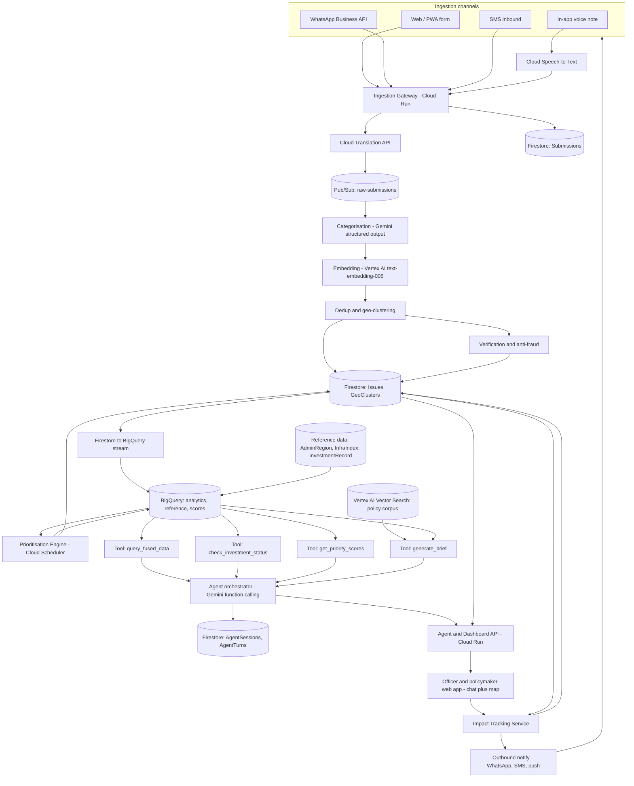

# Architecture: JanSetu

**v2 — corrected 15 Sep 2026.** The v1 Mermaid diagram did not render on GitHub (unquoted parentheses in a node label is a parse error), had an undefined `BQ` node, and left `SCORE` and `VERIFY` as dead ends with no path from Firestore to BigQuery.

## 1. High-level diagram

Every node now has both an inbound and an outbound path, the reference-data join point is explicit, and the impact loop visibly returns to the ingestion channels — which is the whole thesis of the project and was invisible in v1.

## 2. Component responsibilities

| Component | Responsibility | Constraint |
|---|---|---|
| Ingestion Gateway | Normalise all channels to one schema, enforce idempotency, write raw record, publish | **< 2s response, always.** Never blocks on AI |
| Speech-to-Text | Voice → text in source language | Auto-detect, manual override below 0.7 confidence |
| Translation | → canonical working language | Original retained in restricted subcollection |
| Categorisation | Gemini structured output via `responseSchema` | Schema-typed, not prompt-instructed |
| Embedding | 768-dim vector of the summary | `text-embedding-005` |
| Dedup & geo-clustering | Geohash candidate retrieval → Haversine filter → cosine merge | See `AI_PIPELINE.md` Stage 3 |
| Verification / anti-fraud | Rate limits, geofence, burst detection, photo plausibility | Flags for review. **Never auto-rejects** |
| Firestore → BigQuery stream | Keeps the analytics store current | The edge v1's diagram was missing entirely |
| Prioritisation Engine | Batch-computes canonical PriorityScore every 15 min | Single source of truth for all read paths |
| Agent orchestrator | Gemini function calling; parses questions, invokes tools, cites or refuses | Scope injected server-side per tool |
| Tools (×6) | Typed, scoped queries against BigQuery / Vector Search | Model arguments validated before execution |
| Agent & Dashboard API | SSE chat stream, map data, issue reads | `min-instances: 1` on demo day |
| Impact Tracking | Notify original reporters, aggregate confirmations | Feeds `impact_efficacy` back into scoring |

## 3. Data flow narrative

1. Citizen submits on any channel → Gateway normalises, enforces idempotency, writes `Submission`, publishes. Citizen is acknowledged here — nothing downstream can delay this.
2. Worker categorises (Gemini), embeds (Vertex), and runs dedup → merge or create `Issue`.
3. Anti-fraud evaluates the new/updated issue, may set `fraud_flags`.
4. Firestore changes stream to BigQuery, where they join `AdminRegion` / `InfraIndex` / `InvestmentRecord`.
5. Prioritisation Engine batch-scores on schedule, writes canonical `PriorityScore` to both stores.
6. Officer asks a question → Agent selects tools → tools execute scoped queries → agent synthesises with citations, or refuses with a stated reason and an offered alternative.
7. Every turn is written to `AgentTurn` with the full tool trace and result hashes.
8. Officer marks a project complete → reporters are notified on their original channel → confirmations become `ImpactRecord` → efficacy re-enters step 5.

## 4. Tech stack rationale
See `README.md` for the full table. Key rationale points, unchanged from v1 and correct as argued:
- **Cloud Run everywhere** for compute — scales to zero (cost-friendly for a hackathon), no cluster to manage, fast to deploy under time pressure.
- **Firestore for operational writes, BigQuery for analytics** — Firestore's low-latency document writes are right for "citizen just submitted something," while BigQuery's SQL joins are right for "combine this cluster's demand with three different reference datasets."
- **Pub/Sub between ingestion and processing** — decouples "citizen got a response" from "AI pipeline finished," which matters both for perceived speed and for resilience if Gemini has a slow moment.
- **Deterministic scoring formula as the primary path, ML ranking as a stretch** — a government stakeholder will ask "why did my ward score lower," and "the model said so" is a weak answer during a pilot. Explainability is a feature, not a limitation.

One addition: **there is exactly one module permitted to construct a Firestore query** (`scopedQuery()`), and it always injects `country_code` and `state_id` from verified JWT claims. Enforced by an ESLint rule banning direct `.collection()` calls elsewhere. This converts the "Elevation of privilege" threat-model row (`SECURITY_PRIVACY.md` §5) from a promise into a structural guarantee, and it takes five minutes to set up.

## 5. Scalability / federation model ("built for India, and beyond")

Three deployment models, and a deliberate choice about which to build for the hackathon:

- **Option A — Single multi-tenant deployment (build this for the hackathon):** one codebase, one set of services, every collection partitioned by `country_code` + `state_id`. Simpler to build and demo in the available time.
- **Option B — Per-state federated deployment (documented production target):** each state runs its own instance/project with data residency in-state, and a lightweight national aggregator polls a shared, versioned API contract for cross-state reporting. This mirrors how real Indian Digital Public Infrastructure is typically federated.
- **Option C — Cross-border (hackathon Rule 04):** a second `CountryProfile` document plus a boundary dataset — no application code changes. See `CROSS_BORDER_AND_DPG.md`.

The important engineering decision: **the schema and API contract in `DATA_MODEL.md` / `API_SPEC.md` are designed so that moving A → B → C is a deployment/config change, not a data-model rewrite.** Put this on a pitch deck slide as a three-step diagram — it is the clearest evidence the team treated "scale across India," and Rule 04's cross-border requirement, as a structural decision rather than a marketing line.

## 6. Attribution
Maintain a table here of every open-source library, public dataset, and third-party API used, with source and licence, per hackathon Rule 03. `InfraIndex.source_url` and `InfraIndex.licence` carry the per-record version of this. Populate it as you go, not on the last day — reconstructing provenance from memory the night before submission is how teams end up making things up.

| Dataset / Library / API | Source | Licence | Used for |
|---|---|---|---|
| _(fill in during Phase 1-2 as real sources are sourced)_ | | | |
