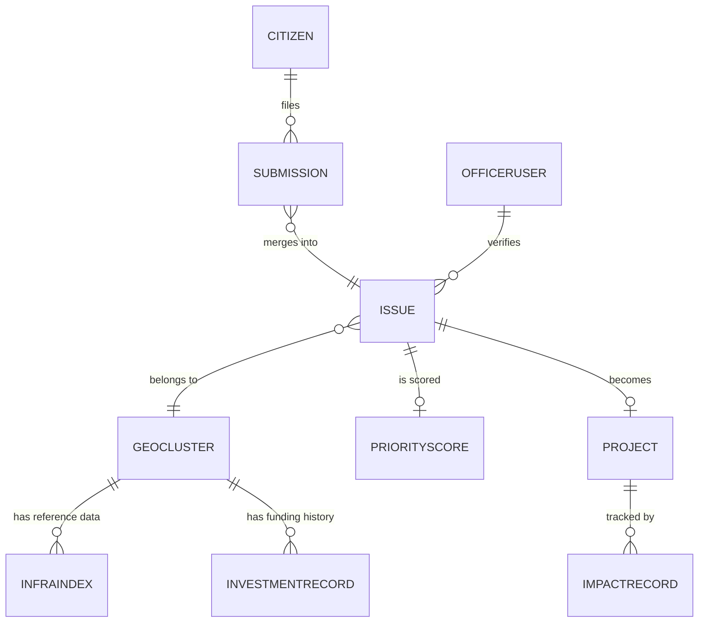

# Data Model: JanSetu

## 1. Entity relationship overview



## 2. Entities

### Citizen
```json
{
  "citizen_id": "cit_9af2",
  "phone_hash": "sha256:...",
  "preferred_language": "hi-IN",
  "created_at": "2026-09-12T10:00:00Z"
}
```
Note: raw phone numbers are never stored outside the auth provider; every other table references `citizen_id` only. See `SECURITY_PRIVACY.md`.

### Submission (raw)
```json
{
  "submission_id": "sub_1a2b3c",
  "citizen_id": "cit_9af2",
  "channel": "whatsapp",
  "raw_text": "sadak me bahut bada gaddha hai",
  "raw_audio_url": null,
  "photo_url": "gs://jansetu-media/photos/sub_1a2b3c.jpg",
  "detected_language": "hi",
  "translated_text": "There is a very large pothole on the road",
  "lat": 28.6139,
  "lng": 77.2090,
  "location_confidence": "high",
  "submitted_at": "2026-09-12T10:02:11Z",
  "status": "processed"
}
```
`status` enum: `queued`, `processing`, `processed`, `flagged`, `rejected`.

### Issue (canonical, deduplicated)
```json
{
  "issue_id": "iss_7d4e",
  "category": "roads",
  "subcategory": "pothole",
  "canonical_description": "Large pothole causing traffic hazard near XYZ market",
  "geo_cluster_id": "gc_442",
  "submission_ids": ["sub_1a2b3c", "sub_9f0a1b", "..."],
  "report_count": 14,
  "first_reported_at": "2026-09-10T08:00:00Z",
  "last_reported_at": "2026-09-14T18:20:00Z",
  "status": "prioritized"
}
```
`status` enum: `open`, `verified`, `disputed`, `prioritized`, `funded`, `in_progress`, `resolved`.

### GeoCluster
```json
{
  "cluster_id": "gc_442",
  "centroid_lat": 28.6140,
  "centroid_lng": 77.2088,
  "admin_boundary": { "ward": "Ward 14", "district": "Central Delhi", "state": "Delhi" },
  "issue_ids": ["iss_7d4e", "iss_88a1"]
}
```

### InfraIndex (external/reference)
```json
{
  "region_id": "gc_442",
  "index_type": "road_density",
  "value": 0.42,
  "source": "Sample derived from public infra survey data",
  "year": 2025
}
```
Other `index_type` values: `water_access`, `health_facility_ratio`, `literacy_rate`, `poverty_index`.

### InvestmentRecord (external/mock, realistic sample data)
```json
{
  "investment_id": "inv_3021",
  "region_id": "gc_442",
  "scheme_name": "Sample Road Maintenance Scheme",
  "amount_inr": 500000,
  "category": "roads",
  "fiscal_year": "2024-25"
}
```

### PriorityScore
```json
{
  "score_id": "score_iss_7d4e_v3",
  "issue_id": "iss_7d4e",
  "demand_score": 0.71,
  "vulnerability_score": 0.55,
  "gap_score": 0.63,
  "duplication_penalty": 0.10,
  "composite_score": 0.635,
  "model_version": "formula-v1",
  "computed_at": "2026-09-15T02:00:00Z"
}
```

### Project
```json
{
  "project_id": "proj_112",
  "issue_id": "iss_7d4e",
  "generated_brief": "Ward 14 has received 14 distinct reports (from 22 raw submissions) about a road hazard since Sep 10. No road maintenance funding recorded in this ward in the last 2 fiscal years. Estimated population impact: ~3,200 residents within 500m.",
  "composite_score": 0.635,
  "status": "recommended",
  "assigned_dept": "PWD",
  "budget_estimate_inr": 500000
}
```

### ImpactRecord
```json
{
  "impact_id": "imp_55",
  "project_id": "proj_112",
  "citizen_confirmations": 9,
  "resolution_photo_url": "gs://jansetu-media/resolutions/proj_112.jpg",
  "resolved_at": "2026-10-20T00:00:00Z",
  "verified_by": "officer_204"
}
```

### OfficerUser
```json
{
  "officer_id": "officer_204",
  "name": "Sample Officer",
  "role": "field_officer",
  "jurisdiction": { "ward": "Ward 14", "district": "Central Delhi", "state": "Delhi" },
  "auth_provider_id": "idp|abc123"
}
```

## 3. Storage mapping

| Entity | Primary store | Why |
|---|---|---|
| Citizen, Submission, Issue, GeoCluster, OfficerUser | Firestore | Low-latency writes/reads, document shape matches JSON above directly |
| InfraIndex, InvestmentRecord, PriorityScore (historical), analytics rollups | BigQuery | SQL joins across reference datasets, cheap large scans |
| Photos, audio, resolution images | Cloud Storage | Firestore/BigQuery store only the `gs://` URL, not blobs |

## 4. Multi-tenancy
Every table/collection carries a `state_id` field (derivable from `admin_boundary.state` on `GeoCluster`). All queries are scoped by `state_id` at the data-access layer — never trusted from client input alone (see `SECURITY_PRIVACY.md`, threat model). This is what lets the Option A → Option B federation move (see `ARCHITECTURE.md`) happen without a schema rewrite.
