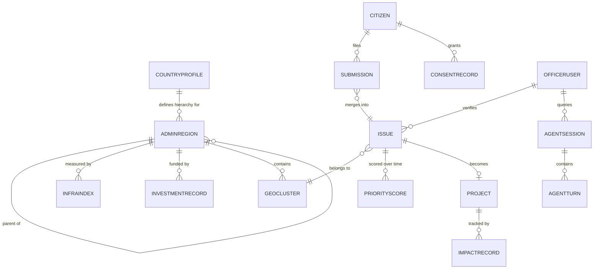

# Data Model: Pramaan

**v2 — corrected 15 Sep 2026.** The three substantive changes from v1: reference data now keys to a stable `AdminRegion` instead of a dynamic `GeoCluster` (this was silently zeroing out `vulnerability_score`/`gap_score` on every issue), `Issue` carries the fields the dedup algorithm actually needs (`embedding`, `geohash`, `distinct_reporter_count`), and a `CountryProfile` makes cross-border portability structural rather than aspirational.

## 1. Entity relationship overview



## 2. Entities

### CountryProfile
The unit of cross-border portability. Adding a country is a document insert plus a boundary dataset, not a code change. See `CROSS_BORDER_AND_DPG.md`.

```json
{
  "country_code": "IN",
  "admin_levels": ["state", "district", "block", "ward"],
  "region_code_authority": "LGD",
  "boundary_dataset_uri": "bq://pramaan.reference.in_admin_boundaries",
  "official_languages": ["hi", "ta", "bn", "mr", "te", "en"],
  "canonical_working_language": "en",
  "currency": "INR",
  "citizen_auth_method": "phone_otp",
  "policy_corpus_id": "corpus_in_v1",
  "data_residency_region": "asia-south1",
  "privacy_regime": "DPDP_2023"
}
```

### AdminRegion
Stable, externally-defined administrative unit. `region_id` uses the country's official code authority — for India, the **LGD (Local Government Directory)** code. All reference data joins here, never to a `GeoCluster`.

```json
{
  "region_id": "LGD:IN-07-091-0014",
  "country_code": "IN",
  "level": "ward",
  "name": "Ward 14",
  "parent_region_id": "LGD:IN-07-091",
  "population": 18400,
  "boundary_ref": "bq://pramaan.reference.in_admin_boundaries/ward/0014",
  "centroid": { "lat": 28.6141, "lng": 77.2085 }
}
```

Rules:
- `region_id` is never generated by Pramaan. It comes from the source authority.
- A missing LGD code is a data-sourcing bug, not a runtime fallback. Log it loudly.
- `parent_region_id` chains up to country. Scoring falls back **up the chain** (ward → block → district → state) when data is missing, and the fallback level is recorded on the score.

### Citizen
```json
{
  "citizen_id": "cit_9af2",
  "phone_hash": "sha256:...",
  "preferred_language": "hi-IN",
  "country_code": "IN",
  "created_at": "2026-09-12T10:00:00Z",
  "erasure_requested_at": null
}
```
Raw phone numbers never leave the auth provider.

### ConsentRecord
```json
{
  "consent_id": "con_771",
  "citizen_id": "cit_9af2",
  "purpose": "infrastructure_prioritisation",
  "consent_text_version": "dpdp-notice-v1-hi",
  "language_shown": "hi-IN",
  "granted_at": "2026-09-12T10:01:55Z",
  "channel": "whatsapp",
  "withdrawn_at": null
}
```

### Submission (raw)
```json
{
  "submission_id": "sub_1a2b3c",
  "idempotency_key": "cli_5f2e9a4c-8b31-4d02-9a17-77c0e1b3d2aa",
  "citizen_id": "cit_9af2",
  "country_code": "IN",
  "state_id": "LGD:IN-07",
  "channel": "whatsapp",
  "raw_text": "sadak me bahut bada gaddha hai",
  "raw_audio_url": null,
  "photo_url": "gs://pramaan-media/photos/sub_1a2b3c.jpg",
  "detected_language": "hi",
  "translated_text": "There is a very large pothole on the road",
  "pii_scrubbed_text": "There is a very large pothole on the road",
  "lat": 28.6139,
  "lng": 77.2090,
  "geohash": "ttnfv2",
  "location_confidence": "high",
  "resolved_region_id": "LGD:IN-07-091-0014",
  "issue_id": "iss_7d4e",
  "submitted_at": "2026-09-12T10:02:11Z",
  "status": "processed",
  "processing_error": null
}
```
`status` enum: `queued`, `processing`, `deferred`, `processed`, `flagged`, `rejected`, `tombstoned`.

- `deferred` — accepted but AI pipeline unavailable; retried by the Pub/Sub DLQ consumer. This is what `AI_PIPELINE_UNAVAILABLE` (`API_SPEC.md` §9) actually resolves to.
- `tombstoned` — erased under DPDP; content fields nulled, ID retained so the parent `Issue` count stays consistent.
- `raw_text` and `raw_audio_url` live in a **restricted-IAM subcollection** with a 90-day TTL. `pii_scrubbed_text` is what flows to BigQuery. This makes both "never discard the source" (`AI_PIPELINE.md` Stage 1) and the PII-scrubbing requirement (`EDGE_CASES.md` #19) true simultaneously.

### Issue (canonical, deduplicated)
```json
{
  "issue_id": "iss_7d4e",
  "country_code": "IN",
  "state_id": "LGD:IN-07",
  "category": "roads",
  "subcategory": "pothole",
  "canonical_description": "Large pothole causing traffic hazard near XYZ market",
  "embedding": [0.0123, -0.0456, "... 768 floats ..."],
  "embedding_model": "text-embedding-005",
  "geo_cluster_id": "gc_442",
  "admin_region_id": "LGD:IN-07-091-0014",
  "geohash": "ttnfv2",
  "centroid_lat": 28.6140,
  "centroid_lng": 77.2088,
  "submission_ids": ["sub_1a2b3c", "sub_9f0a1b"],
  "report_count": 14,
  "distinct_reporter_count": 11,
  "first_reported_at": "2026-09-10T08:00:00Z",
  "last_reported_at": "2026-09-14T18:20:00Z",
  "emergency_override": false,
  "fraud_flags": [],
  "status": "prioritized"
}
```
`status` enum: `open`, `verified`, `disputed`, `prioritized`, `funded`, `in_progress`, `resolved`, `tombstoned`.

Notes:
- `embedding` is stored **on the Issue**, at 768 dimensions for `text-embedding-005`. Firestore's 1 MiB document limit is not at risk (768 floats ≈ 6 KB).
- `geohash` is precision 6 on the centroid. The dedup candidate query is a prefix range over this field plus its 8 neighbours — see `AI_PIPELINE.md` Stage 3.
- `distinct_reporter_count` is what feeds `demand_score`. `report_count` is for display. One person filing twelve times is one unit of demand — this is what `EDGE_CASES.md` #4 was reaching for, and keeping the two counts separate makes it enforceable rather than aspirational.

### GeoCluster
```json
{
  "cluster_id": "gc_442",
  "country_code": "IN",
  "state_id": "LGD:IN-07",
  "admin_region_id": "LGD:IN-07-091-0014",
  "centroid_lat": 28.6140,
  "centroid_lng": 77.2088,
  "geohash": "ttnfv2",
  "radius_m": 300,
  "issue_ids": ["iss_7d4e", "iss_88a1"]
}
```
`admin_region_id` is resolved once at cluster creation by point-in-polygon against the boundary dataset — **never** by trusting citizen-typed admin names (`EDGE_CASES.md` #17).

### InfraIndex (external/reference, keyed to AdminRegion)
```json
{
  "region_id": "LGD:IN-07-091-0014",
  "index_type": "road_density",
  "value": 0.42,
  "normalised_value": 0.38,
  "source": "Census of India District Handbook 2011 (public)",
  "source_url": "https://censusindia.gov.in/...",
  "licence": "Government Open Data Licence - India",
  "year": 2025
}
```
`index_type`: `road_density`, `water_access`, `health_facility_ratio`, `literacy_rate`, `poverty_index`, `electrification_rate`.

`normalised_value` is the 0-1 percentile within the country, precomputed at load time. Scoring never normalises at query time — that would make scores non-reproducible as the dataset grows.

`source` / `source_url` / `licence` are mandatory. Hackathon Rule 03 requires attribution and this is where it lives.

### InvestmentRecord (external/mock, keyed to AdminRegion)
```json
{
  "investment_id": "inv_3021",
  "region_id": "LGD:IN-07-091-0014",
  "scheme_name": "Sample Road Maintenance Scheme",
  "scheme_id": "PMGSY",
  "amount": 500000,
  "currency": "INR",
  "category": "roads",
  "fiscal_year": "2024-25",
  "sanctioned_at": "2024-06-01",
  "data_origin": "synthetic_demo"
}
```
`data_origin` is `public_dataset` | `synthetic_demo` | `partner_feed`. **Every synthetic record must be flagged.** The hackathon explicitly rewards honesty about what is real — surface this field in the UI as a badge, don't bury it in a README line.

### PriorityScore
```json
{
  "score_id": "score_iss_7d4e_v3",
  "issue_id": "iss_7d4e",
  "demand_score": 0.71,
  "vulnerability_score": 0.55,
  "gap_score": 0.63,
  "duplication_penalty": 0.10,
  "impact_efficacy": null,
  "base_score": 0.638,
  "composite_score": 0.628,
  "weights": { "demand": 0.40, "vulnerability": 0.30, "gap": 0.30 },
  "data_fallbacks": [
    { "component": "vulnerability_score", "used_level": "district", "reason": "no ward-level poverty_index" }
  ],
  "model_version": "formula-v2",
  "computed_at": "2026-09-15T02:00:00Z",
  "is_canonical": true
}
```
`data_fallbacks` is the machine-readable version of `EDGE_CASES.md` #7. The generated brief reads this array and discloses every fallback in prose. That turns a missing-data weakness into a visible honesty feature.

`is_canonical: true` marks the scheduled batch score. Agent what-if simulations write `false` and are never shown on the map (see `AI_PIPELINE.md` Stage 5, `simulate_priority`).

### Project
```json
{
  "project_id": "proj_112",
  "issue_id": "iss_7d4e",
  "generated_brief": "Ward 14 has received 14 distinct reports (from 22 raw submissions) about a road hazard since Sep 10. No road maintenance funding recorded in this ward in the last 2 fiscal years. Estimated population impact: ~3,200 residents within 500m.",
  "brief_model_version": "gemini-2.5-flash / brief-prompt-v3",
  "brief_citations": [
    { "claim": "14 distinct reports since Sep 10", "source": "tool:query_fused_data", "field": "distinct_reporter_count" },
    { "claim": "No road funding in last 2 FY", "source": "tool:check_investment_status" },
    { "claim": "Eligible under PMGSY maintenance provision", "source": "rag:corpus_in_v1/pmgsy_guidelines.pdf#p14" }
  ],
  "groundedness_check": { "passed": true, "unverified_claims": [] },
  "composite_score": 0.628,
  "status": "recommended",
  "assigned_dept": "PWD",
  "budget_estimate_inr": 500000
}
```
`brief_citations` is generated by the post-generation verifier, not by Gemini. This is the artifact you put on screen when a judge asks "how do you know it didn't hallucinate."

### ImpactRecord
```json
{
  "impact_id": "imp_55",
  "project_id": "proj_112",
  "issue_id": "iss_7d4e",
  "category": "roads",
  "region_id": "LGD:IN-07-091-0014",
  "confirmations_received": 9,
  "confirmations_required": 3,
  "confirmations_negative": 1,
  "resolution_photo_url": "gs://pramaan-media/resolutions/proj_112.jpg",
  "resolved_at": "2026-10-20T00:00:00Z",
  "verified_by": "officer_204",
  "efficacy": 0.90
}
```
`efficacy` = positive confirmations / total responses. Aggregated by `(category, region_id)` this becomes the `impact_efficacy` term that actually closes the loop in the scoring formula — see `AI_PIPELINE.md` Stage 6. In earlier drafts the loop was described in prose but appeared nowhere in the maths.

Two further fields make the counts trustworthy:
- **`confirmed_by: string[]`** lists who has answered in the current round, so each reporter counts once. An entry is a citizen id, or `sub:<submission_id>` for an anonymous reporter answering with a tracking code.
- **`reopened_count`** counts how many times citizens rejected the fix. A rejection sends the project back to `in_progress`, and the next round of answers starts empty.

`confirmations_required` = `min(3, identified reporters)` (never below 1). Identified reporters are signed-in reporters plus anonymous reports carrying a tracking code.

### OfficerUser
```json
{
  "officer_id": "officer_204",
  "name": "Sample Officer",
  "role": "field_officer",
  "country_code": "IN",
  "region_id": "LGD:IN-07-091-0014",
  "auth_provider_id": "idp|abc123"
}
```
`region_id` (LGD) replaces a free-text `jurisdiction` object. Jurisdiction checks become an ancestor test on the region chain, which is enforceable server-side; string comparison on `"Ward 14"` is not.

### AgentSession / AgentTurn (audit & traceability)
A session is a conversation; a turn is one question and its full evidence trace. Splitting them is what makes the audit trail queryable.

```json
// AgentSession
{ "session_id": "sess_88b2", "officer_id": "officer_204", "region_scope": "LGD:IN-07-091-0014",
  "started_at": "2026-09-15T09:28:00Z", "turn_count": 4 }

// AgentTurn
{
  "turn_id": "turn_88b2_02",
  "session_id": "sess_88b2",
  "query_text": "What are the top 3 unaddressed road issues here, and are they already funded?",
  "tool_calls": [
    { "tool": "query_fused_data", "params": {"category":"roads","region_id":"LGD:IN-07-091-0014"},
      "result_hash": "sha256:ab12...", "latency_ms": 340, "row_count": 3 },
    { "tool": "check_investment_status", "params": {"category":"roads","region_id":"LGD:IN-07-091-0014"},
      "result_hash": "sha256:cd34...", "latency_ms": 210, "row_count": 0 }
  ],
  "agent_response": "...",
  "citations": [ { "span": [0, 42], "source": "tool:query_fused_data" } ],
  "refused": false,
  "refusal_reason": null,
  "prompt_version": "agent-system-v2",
  "total_latency_ms": 2180,
  "timestamp": "2026-09-15T09:30:00Z"
}
```
`result_hash` lets you prove after the fact that the answer matched the data, without storing a duplicate copy of the data.

### Workflow and engagement (added with the RBAC console)
These collections and fields exist in `packages/shared-types` and both stores, though the entities above predate them.

**New fields on `Issue`:**

| Field | Meaning |
|---|---|
| `support_count` | "I'm affected too" endorsements. Shown to officers and the public; never feeds `demand_score` (only distinct reporters do), so it cannot be used to game a ranking |
| `assigned_to_uid`, `assigned_to_label`, `assigned_at` | The officer accountable for the next step |
| `sla_due_at` | Officer override of the default SLA. The default comes from the priority band: emergency 2 days, high 7, medium 21, low 45 |
| `escalation_notified` | Highest escalation level already notified (1: collector, 2: state admin), so each level alerts once |
| `centroid_lat`, `centroid_lng` | Exact report location, used for dedup and the officer map; the public map rounds it to ~1 km |
| `is_synthetic` | Illustrative sample data; the UI labels it everywhere |

**New field on `Submission`:** `tracking_code` (`JS-XXXXXXXX`). The only credential an anonymous reporter needs to follow a report and to confirm the fix.

**New collections:**

| Collection | Shape | Notes |
|---|---|---|
| `issueSupports` | `{issue_id, citizen_id, created_at}`, doc id `<issue>_<citizen>` | One endorsement per citizen (idempotent `create`). Supporters receive the issue's notifications |
| `issueComments` | `{comment_id, issue_id, author_id, author_label, author_role, body, created_at}` | Officer-only internal notes |
| `notifications` | `{notification_id, recipient_id, kind, params, link, created_at, read_at}` | In-app inbox. Stored as `kind` + `params` and rendered in the reader's language, never pre-translated |
| `budgetPlans` | `{plan_id, name, region_id, created_by, status, params, items[], totals, approved_at}` | Items are recomputed server-side on save; approval funds them |
| `auditLog` | `{audit_id, actor_id, action, target_id, before, after, justification, timestamp}` | Every officer action and every citizen reopen (`actor_id: "citizens"`) |
| `media` | `{kind, contentType, data, size, created_at}` | Free-plan photo/audio store (Firestore, ≤ ~900 KB). On GCP this is Cloud Storage. Only URLs minted by `POST /media` are accepted anywhere |

## 3. Storage mapping

| Entity | Store | Why |
|---|---|---|
| Citizen, ConsentRecord, Submission, Issue, GeoCluster, OfficerUser, AgentSession, AgentTurn, Project | Firestore (`asia-south1`) | Low-latency writes, document shape matches |
| `Submission.raw_text` / `raw_audio_url` | Firestore restricted subcollection, 90-day TTL | PII minimisation with auditability |
| AdminRegion, InfraIndex, InvestmentRecord, PriorityScore (history), ImpactRecord rollups, admin boundaries | BigQuery (`asia-south1`) | SQL joins, GIS functions, cheap scans |
| Policy corpus chunks + vectors | Vertex AI Vector Search | RAG retrieval |
| Photos, audio, resolution images | Cloud Storage | Only `gs://` URIs in the DBs |

## 4. Required Firestore indexes
Create these on Day 1 — missing composite indexes surface as runtime errors mid-demo.

```
issues:       (state_id ASC, category ASC, geohash ASC)
issues:       (state_id ASC, status ASC, composite_score DESC)
issues:       (admin_region_id ASC, category ASC, status ASC)
submissions:  (citizen_id ASC, submitted_at DESC)
submissions:  (idempotency_key ASC)              # unique-enforced in app layer
submissions:  (status ASC, submitted_at ASC)     # deferred-retry sweep
agent_turns:  (session_id ASC, timestamp ASC)
```

## 5. Multi-tenancy and residency
Every collection carries `country_code` and `state_id`. Scoping is applied at the data-access layer from the caller's verified JWT claims — **never** from a client-supplied parameter. There is exactly one function (`scopedQuery()`) that may construct a Firestore query, and it always injects the scope. Enforce with a lint rule banning direct `.collection()` calls outside that module; it is a five-minute ESLint rule and it makes threat-model row "Elevation of privilege" (`SECURITY_PRIVACY.md` §5) a structural guarantee rather than a promise.

This is what makes the Option A → Option B → cross-country move (`ARCHITECTURE.md` §5) a config change.
